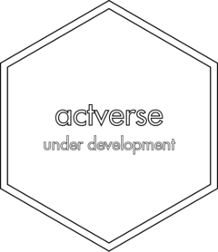

<!-- README.md is generated from README.Rmd. Please edit that file -->

# actstudio <a href='https://gipsousp.github.io/actstudio'></a>

<!-- badges: start -->

[](https://www.repostatus.org/#wip)
[](https://www.tidyverse.org/lifecycle/#experimental)
[](https://github.com/gipsousp/actstudio/actions)
[](https://travis-ci.com/gipsousp/actstudio)
[](https://codecov.io/gh/gipsousp/actstudio?branch=master)
[](https://gipsousp.github.io/actstudio/CODE_OF_CONDUCT.html)
<!-- badges: end -->

## Overview

`actstudio` provides a consistent and fast way to process, analyze and
visualize actigraphic data in R. It’s designed to parse data from many
devices used for clinic and research purposes.

Please note that this package is currently on the development stage and
have not been [peer
reviewed](https://devguide.ropensci.org/softwarereviewintro.html) yet.
That means that people can try it out and provide feedback, but it comes
with no promises for long term stability.

## Installation

You can install the development version from
[GitHub](https://github.com/) with:

``` r
# install.packages("devtools")
devtools::install_github("gipsousp/mctq")
```

## Citation

If you use `actstudio` in your research, please consider citing it. We
put a lot of work to build and maintain a free and open source R
package. You can find `actstudio` citation
[here](https://gipsousp.github.io/actstudio/authors.html).

## Contributing

`actstudio` is a community project, anyone and everyone is welcome to
contribute. Take a moment to review our [Guidelines for
Contributing](https://gipsousp.github.io/actstudio/CONTRIBUTING.html).

Please note that `actstudio` is released with a [Contributor Code of
Conduct](https://gipsousp.github.io/actstudio/CODE_OF_CONDUCT.html). By
contributing to this project, you agree to abide by its terms.
