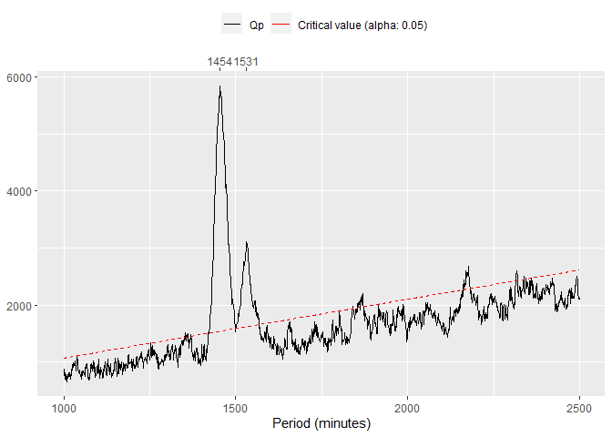
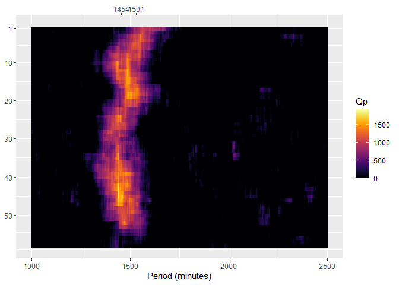
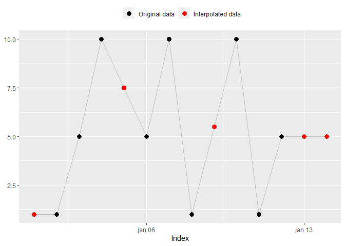

<!-- README.md is generated from README.Rmd. Please edit that file -->

# actverse

<!-- badges: start -->

[](https://www.repostatus.org/#wip)
[](https://lifecycle.r-lib.org/articles/stages.html)
[](https://github.com/giperbio/actverse/actions)
[](https://app.codecov.io/gh/giperbio/actverse?branch=main)
[](https://choosealicense.com/licenses/mit/)
[](https://giperbio.github.io/actverse/CODE_OF_CONDUCT.html)
<!-- badges: end -->

## Overview

`actverse` is an R package that provides a complete toolkit to process,
analyze and visualize actigraphy data. Its aim is to facilitate the work
of sleep and chronobiology scientists with actigraphy data and to
improve reproducibility in research.

`actverse` adheres to the [tidyverse
principles](https://tidyverse.tidyverse.org/articles/manifesto.html) and
integrates with the [tidyverse ecosystem](https://www.tidyverse.org/).

## Prerequisites

You need to have some familiarity with the [R programming
language](https://www.r-project.org/) and with the
[`tsibble`](https://tsibble.tidyverts.org/index.html) package to use
`actverse` main functions.

If you don’t feel comfortable with R, we strongly recommend checking
Hadley Wickham and Garrett Grolemund’s free and online book [R for Data
Science](https://r4ds.had.co.nz/) and the Coursera course from John
Hopkins University [Data Science: Foundations using
R](https://www.coursera.org/specializations/data-science-foundations-r)
(free for audit students).

Please refer to the
[`tsibble`](https://tsibble.tidyverts.org/index.html) package
documentation to learn more about it. `tsibble` is an essential package
to deal with time series in R. We also recommend that you read the
[Dates and times](https://r4ds.had.co.nz/dates-and-times.html) chapter
from Wickham & Grolemund’s book [R for Data
Science](https://r4ds.had.co.nz/) and the [tsibble
objects](https://otexts.com/fpp3/tsibbles.html) subchapter from Rob J.
Hyndman & George Athanasopoulos’ book [Forecasting: Principles and
Practice](https://otexts.com/fpp3/).

## Installation

You can install `actverse` with:

``` r
# install.packages("remotes")
remotes::install_github("giperbio/actverse")
```

## Usage

The R ecosystem has a [vast
number](https://cran.r-project.org/view=TimeSeries) of time series
standards and we had to choose one of them while developing `actverse`.
A standard for time objects is a must, because [time can have many
representations](https://youtu.be/eelVqfm8vVc) and can be rooted in
different numerical systems. We believe that the best time series
standard available for packages that adheres to the [tidyverse
principles](https://tidyverse.tidyverse.org/articles/manifesto.html) is
the [`tsibble`](https://tsibble.tidyverts.org/index.html). As the name
suggests, `tsibble` is an adaptation for time series of the
[tidyverse](https://www.tidyverse.org/)
[`tibble`](https://tibble.tidyverse.org/) object.

Most `actverse` functions will require that your data be in the
[`tsibble`](https://tsibble.tidyverts.org/index.html) standard. Adapting
your data is a simple process and can make a big difference when dealing
with time series in R. Please refer to
[`tsibble`](https://tsibble.tidyverts.org/index.html) documentation to
learn how to do this.

We also recommend seeing the [`tsbox`](https://www.tsbox.help/) package,
an R package that propose to be an “universal translator” (🖖) for R
time series standards.

### Read/Write

- `read_acttrust()`: Read, tidy, and validate an
  [ActTrust](https://condorinst.com.br/acttrust-actigrafo/) file.
- `write_acttrust()`: Adapt and write a `tsibble` to a readable
  [ActTrust](https://condorinst.com.br/acttrust-actigrafo/) file.

Example:

``` r
file <- get_from_zenodo(
    doi = "10.5281/zenodo.4898822", path = tempdir(),
    file = "processed.txt"
)

data <- read_acttrust(file, tz = "America/Sao_Paulo")

data
#> # A tsibble: 51,806 x 17 [1m] <America/Sao_Paulo>
#>    timestamp             pim   tat   zcm orienta…¹ wrist…² exter…³ light ambie…⁴
#>    <dttm>              <dbl> <dbl> <dbl>     <dbl>   <dbl>   <dbl> <dbl>   <dbl>
#>  1 2021-04-24 04:14:00  7815   608   228         0    26.9    24.6  3.58    1.45
#>  2 2021-04-24 04:15:00  2661   160    64         0    27.2    25.1  5.23    2.12
#>  3 2021-04-24 04:16:00  3402   243    80         0    27.7    25.5  3.93    1.59
#>  4 2021-04-24 04:17:00  4580   317   125         0    27.9    25.8  4.14    1.68
#>  5 2021-04-24 04:18:00  2624   255    33         0    28.0    25.9  3.16    1.28
#>  6 2021-04-24 04:19:00  3929   246   105         0    28.1    26.1  3.63    1.47
#>  7 2021-04-24 04:20:00  5812   369   171         0    28.2    26.4 11.5     4.67
#>  8 2021-04-24 04:21:00  3182   270    54         0    28.4    26.7  2.4     0.97
#>  9 2021-04-24 04:22:00  6362   373   189         0    28.6    26.9  3.28    1.33
#> 10 2021-04-24 04:23:00  2621   159    64         0    28.7    27.1  2.97    1.2 
#> # … with 51,796 more rows, 8 more variables: red_light <dbl>,
#> #   green_light <dbl>, blue_light <dbl>, ir_light <dbl>, uva_light <dbl>,
#> #   uvb_light <dbl>, event <dbl>, state <dbl>, and abbreviated variable names
#> #   ¹​orientation, ²​wrist_temperature, ³​external_temperature, ⁴​ambient_light
```

### Period functions

- `periodogram()`: Compute Sokolove & Bushell’s $\chi^{2}$ periodogram.
- `spectrogram()`: Compute a spectrogram based on Sokolove & Bushell’s
  periodogram.

Example:

``` r
per <- periodogram(data, "pim")
```



``` r

spec <- spectrogram(data, "pim")
```



### Data interpolation

- `na_approx()` `na_locf()` `na_overall_mean()` `na_overall_median()`
  `na_overall_mode()` `na_spline()` `na_weekly_mean()` `na_zero()`
  `na_plot()`: Replace `NA` by interpolation.

Example:

``` r
x <- c(NA, 1, 5, 10, NA, 5, 10, 1, NA, 10, 1, 5, NA, NA)
index <- seq(as.Date("2020-01-01"), as.Date("2020-01-14"), by = "day")

na_approx(x, index, fill_na_tips = TRUE)
#>  [1]  1.0  1.0  5.0 10.0  7.5  5.0 10.0  1.0  5.5 10.0  1.0  5.0  5.0  5.0
na_plot(x, index, na_approx(x, index, fill_na_tips = TRUE))
```



### API clients

- `get_from_zenodo()`: Get data from a Zenodo record.
- `get_sun_stats()`: Get sun related statistics from different APIs.

Example:

``` r
get_sun_stats(lat = -23.5489, lon = -46.6388, tz = "America/Sao_Paulo") %>%
    dplyr::as_tibble() %>% 
    t()
#>                   [,1]               
#> date              "2023-02-23"       
#> lat               "-23.5489"         
#> lon               "-46.6388"         
#> tz                "America/Sao_Paulo"
#> sunrise_start     "06:00:15"         
#> sunrise_end       "06:02:37"         
#> golden_hour_end   "06:30:30"         
#> solar_noon        "12:21:26"         
#> golden_hour_start "18:12:22"         
#> sunset_start      "18:40:15"         
#> sunset_end        "18:42:37"         
#> dusk              "19:05:42"         
#> nautical_dusk     "19:32:49"         
#> night_start       "20:00:22"         
#> nadir             "00:21:26"         
#> night_end         "04:42:30"         
#> nautical_dawn     "05:10:04"         
#> dawn              "05:37:10"
```

### Other features

`actverse` also comes with many utility functions and provides free
actigraphy datasets for testing and learning purposes.

All functions are properly documented, showing all the guidelines behind
the computations. Click [here](https://giperbio.github.io/actverse/) to
see a list of them.

Example:

``` r
# Find the epochs/periodicities in a 'tsibble'
read_acttrust(file, regularize = FALSE) %>%
    find_epoch()
#> $best_match
#> [1] 60
#> 
#> $prevalence
#> # A tibble: 4 × 2
#>   epoch proportion
#>   <dbl>      <dbl>
#> 1    60  1.00     
#> 2    94  0.0000193
#> 3    86  0.0000193
#> 4   101  0.0000193
```

## Citation

If you use `actverse` in your research, please consider citing it. We
put a lot of work to build and maintain a free and open-source R
package. You can find the `actverse` citation below.

``` r
citation("actverse")
#> 
#> To cite {actverse} in publications use:
#> 
#>   Vartanian, D., Matias, V. A., Serrano, C. A. M., & Benedito-Silva, A.
#>   A. (2023). {actverse}: tools for actigraphy data analysis. R package
#>   version 0.0.0.9000. https://giperbio.github.io/actverse/
#> 
#> A BibTeX entry for LaTeX users is
#> 
#>   @Unpublished{,
#>     title = {{actverse}: tools for actigraphy data analysis},
#>     author = {Daniel Vartanian and Vinicius {Alves Matias} and Cassio {Almeida Mattos Serrano} and Ana Amelia Benedito-Silva},
#>     year = {2023},
#>     url = {https://giperbio.github.io/actverse/},
#>     note = {R package version 0.0.0.9000},
#>   }
```

## Contributing

We welcome contributions, including bug reports.

Take a moment to review our [Guidelines for
Contributing](https://giperbio.github.io/actverse/CONTRIBUTING.html).

## Acknowledgments

The initial development of `actverse` was supported by three
scholarships provided by the [University of Sao Paulo
(USP)](http://usp.br/) (❤️).

<br>

Become an `actverse` supporter!

Click [here](https://github.com/sponsors/danielvartan) to make a
donation. Please indicate the `actverse` package in your donation
message.
