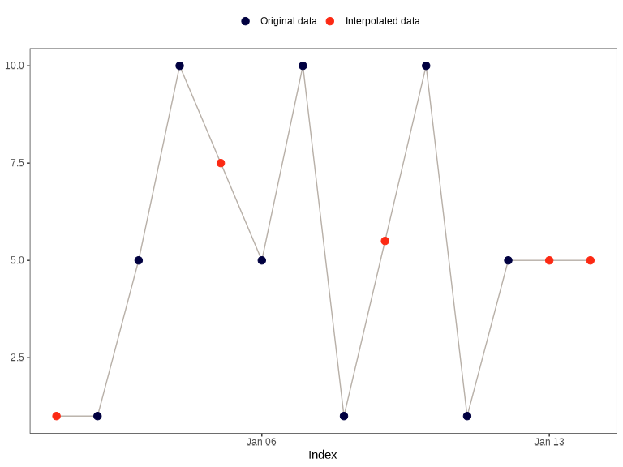

# actverse <a href = "https://danielvartan.github.io/brandr/"></a>

<!-- quarto render -->

<!-- badges: start -->
[](https://www.repostatus.org/#active)
[](https://github.com/danielvartan/actverse/actions/workflows/check-standard.yaml)
[](https://app.codecov.io/gh/danielvartan/actverse?branch=main)
[](https://choosealicense.com/licenses/mit/)
[](CODE_OF_CONDUCT.md)
<!-- badges: end -->

## Overview

`actverse` is an R package that offers a comprehensive toolkit for
processing, analyzing, and visualizing actigraphy data. It is designed
to support sleep and chronobiology researchers by streamlining workflows
and enhancing reproducibility in actigraphy research.

The package is built on [tidyverse
principles](https://tidyverse.tidyverse.org/articles/manifesto.html) and
integrates seamlessly with the [tidyverse
ecosystem](https://www.tidyverse.org/), ensuring a consistent and
user-friendly experience for data manipulation and analysis.

> If you find this project useful, please consider giving it a star!  
> [](https://github.com/danielvartan/actverse/)

## Installation

You can install `actverse` using the
[`remotes`](https://github.com/r-lib/remotes) package:

``` r
remotes::install_github("danielvartan/actverse")
```

## Usage

The R ecosystem offers a [wide
variety](https://cran.r-project.org/view=TimeSeries) of time series
standards, and selecting the right one was an important decision in
developing `actverse`. A consistent standard for time objects is
essential, as [time can be represented in many
ways](https://youtu.be/eelVqfm8vVc) and may be based on different
numerical systems. For packages that follow [tidyverse
principles](https://tidyverse.tidyverse.org/articles/manifesto.html), we
believe the [`tsibble`](https://tsibble.tidyverts.org/index.html)
package provides the best time series standard. As its name suggests,
`tsibble` extends the [tidyverse](https://www.tidyverse.org/)
[`tibble`](https://tibble.tidyverse.org/) object for time series data.

Most `actverse` functions require your data to be in the
[`tsibble`](https://tsibble.tidyverts.org/index.html) format. Converting
your data is straightforward and can significantly improve your
experience working with time series in R. Please refer to the
[`tsibble`](https://tsibble.tidyverts.org/index.html) documentation for
guidance on adapting your data.

### Read/Write

- `read_acttrust()`: Read, tidy, and validate an
  [ActTrust](https://condorinst.com/en/) file.
- `write_acttrust()`: Write a `tsibble` to a readable
  [ActTrust](https://condorinst.com/en/) file.

Example:

``` r
file <- get_from_zenodo(
  doi = "10.5281/zenodo.4898822",
  dir = tempdir(),
  file = "processed.txt"
)
```

``` r
data <- file |> read_acttrust(tz = "America/Sao_Paulo")
```

``` r
library(dplyr)

data |> glimpse()
#> Rows: 51,806
#> Columns: 17
#> $ timestamp            <dttm> 2021-04-24 04:14:00, 2021-04-24 04:15:00, 202…
#> $ pim                  <dbl> 7815, 2661, 3402, 4580, 2624, 3929, 5812, 3182…
#> $ tat                  <dbl> 608, 160, 243, 317, 255, 246, 369, 270, 373, 1…
#> $ zcm                  <dbl> 228, 64, 80, 125, 33, 105, 171, 54, 189, 64, 6…
#> $ orientation          <dbl> 0, 0, 0, 0, 0, 0, 0, 0, 0, 0, 0, 0, 0, 0, 0, 0…
#> $ wrist_temperature    <dbl> 26.87, 27.18, 27.68, 27.86, 28.04, 28.13, 28.2…
#> $ external_temperature <dbl> 24.62, 25.06, 25.50, 25.75, 25.94, 26.06, 26.3…
#> $ light                <dbl> 3.58, 5.23, 3.93, 4.14, 3.16, 3.63, 11.53, 2.4…
#> $ ambient_light        <dbl> 1.45, 2.12, 1.59, 1.68, 1.28, 1.47, 4.67, 0.97…
#> $ red_light            <dbl> 0.57, 0.86, 0.64, 0.67, 0.51, 0.56, 3.22, 0.37…
#> $ green_light          <dbl> 0.66, 0.95, 0.71, 0.75, 0.57, 0.68, 3.49, 0.44…
#> $ blue_light           <dbl> 0.24, 0.36, 0.26, 0.28, 0.21, 0.30, 1.48, 0.20…
#> $ ir_light             <dbl> 0.17, 0.25, 0.20, 0.20, 0.16, 0.18, 1.00, 0.13…
#> $ uva_light            <dbl> 0, 0, 0, 0, 0, 0, 0, 0, 0, 0, 0, 0, 0, 0, 0, 0…
#> $ uvb_light            <dbl> 0, 0, 0, 0, 0, 0, 0, 0, 0, 0, 0, 0, 0, 0, 0, 0…
#> $ event                <dbl> 1, 0, 0, 0, 0, 0, 0, 0, 0, 0, 0, 0, 0, 0, 0, 0…
#> $ state                <dbl> 0, 0, 0, 0, 0, 0, 0, 0, 0, 0, 0, 0, 0, 0, 0, 0…
```

### Period Functions

- [`periodogram()`](https://danielvartan.github.io/actverse/reference/periodogram.html):
  Compute Sokolove & Bushell’s $\chi^{2}$ periodogram.
- [`spectrogram()`](https://danielvartan.github.io/actverse/reference/spectrogram.html):
  Create a spectrogram plot based on Sokolove & Bushell’s $\chi^{2}$
  periodogram.

Example:

``` r
data |> periodogram("pim")
```


``` r
data |> spectrogram("pim")
```


### Data Visualization

We strongly recommend using the [`ragg`](https://ragg.r-lib.org/)
package as your backend graphics device for complex data visualizations.
It is faster and produces higher quality images than R default graphics
device.

- [`actogram()`](https://danielvartan.github.io/actverse/reference/actogram.html):
  Create an actogram plot from actigraphy data.

``` r
data |>
  actogram(
    col = "pim",
    days = -1,
    latitude = -23.55065,
    longitude = -46.63338,
    double_plot = TRUE
  )
```


### Data Interpolation

- [`na_approx()`](https://danielvartan.github.io/actverse/reference/na_approx.html)
  `na_locf()` `na_overall_mean()` `na_overall_median()`
  `na_overall_mode()` `na_spline()` `na_weekly_mean()` `na_zero()`
  `na_plot()`: Interpolate missing values in a numeric vector.

Example:

``` r
x <- c(NA, 1, 5, 10, NA, 5, 10, 1, NA, 10, 1, 5, NA, NA)
index <- seq(as.Date("2020-01-01"), as.Date("2020-01-14"), by = "day")

na_approx(x, index, fill_na_tips = TRUE)
#>  [1]  1.0  1.0  5.0 10.0  7.5  5.0 10.0  1.0  5.5 10.0  1.0  5.0  5.0  5.0
```

``` r
na_plot(x, index, na_approx(x, index, fill_na_tips = TRUE))
```



### API Clients

- [`get_from_zenodo()`](https://danielvartan.github.io/actverse/reference/get_from_zenodo.html):
  Get data from a Zenodo record.
- [`get_sun_stats()`](https://danielvartan.github.io/actverse/reference/get_sun_stats.html):
  Get sun related statistics from different APIs.

Example:

``` r
library(rutils) # github.com/danielvartan/rutils

get_sun_stats(
  latitude = -23.5489,
  longitude = -46.6388,
  tz = "America/Sao_Paulo"
) |>
  rutils:::list_as_tibble() |>
  print(n = Inf)
#> # A tibble: 18 × 2
#>    name              value            
#>    <chr>             <chr>            
#>  1 date              2025-05-10       
#>  2 latitude          -23.5489         
#>  3 longitude         -46.6388         
#>  4 tz                America/Sao_Paulo
#>  5 sunrise_start     06:32:22         
#>  6 sunrise_end       06:34:50         
#>  7 golden_hour_end   07:04:14         
#>  8 solar_noon        12:04:16         
#>  9 golden_hour_start 17:04:19         
#> 10 sunset_start      17:33:43         
#> 11 sunset_end        17:36:10         
#> 12 dusk              17:59:51         
#> 13 nautical_dusk     18:27:01         
#> 14 night_start       18:53:54         
#> 15 nadir             00:04:16         
#> 16 night_end         05:14:39         
#> 17 nautical_dawn     05:41:31         
#> 18 dawn              06:08:41
```

### Other Features

`actverse` also comes with many utility functions and provides
actigraphy datasets for testing and learning purposes.

All functions are thoroughly documented, with detailed explanations of
the underlying methodologies and computational guidelines. For a
complete list of available functions and their documentation, click
[here](https://danielvartan.github.io/actverse/).

Example:

``` r
file |>
  read_acttrust(regularize = FALSE) |>
  find_epoch()
#> $best_match
#> [1] 60
#> 
#> $prevalence
#> # A tibble: 4 × 2
#>   epoch proportion
#>   <dbl>      <dbl>
#> 1    60  1.00     
#> 2    94  0.0000193
#> 3    86  0.0000193
#> 4   101  0.0000193
```

## How to Cite

``` r
citation("actverse")
#> To cite {actverse} in publications use:
#> 
#>   Vartanian, D., Matias, V. A., Serrano, C. A. M., & Benedito-Silva,
#>   A. A. (2025). {actverse}: A Tidyverse-style toolbox for actigraphy
#>   data analysis [Computer software, R package].
#>   https://danielvartan.github.io/actverse/
#> 
#> A BibTeX entry for LaTeX users is
#> 
#>   @Misc{,
#>     title = {{actverse}: A Tidyverse-style toolbox for actigraphy data analysis},
#>     author = {Daniel Vartanian and Vinicius Alves Matias and Cassio Almeida Mattos Serrano and Ana Amélia Benedito-Silva},
#>     year = {2025},
#>     url = {https://danielvartan.github.io/actverse/},
#>     note = {R package},
#>   }
```

## License

[](https://choosealicense.com/licenses/mit/)

`actverse` code is released under the [MIT
license](https://opensource.org/license/mit). This means you can use,
modify, and distribute the code freely, as long as you include the
original license and copyright notice in any copies or substantial
portions of the software.

## Contributing

[](https://www.contributor-covenant.org/version/2/1/code_of_conduct/)

Contributions are welcome, including bug reports. Take a moment to
review our [Guidelines for
Contributing](https://danielvartan.github.io/actverse/CONTRIBUTING.html).

<br>

[](https://github.com/sponsors/danielvartan)

Become an `actverse` sponsor!

Click [here](https://github.com/sponsors/danielvartan) to make a
donation. Please indicate the `actverse` package in your donation
message.
