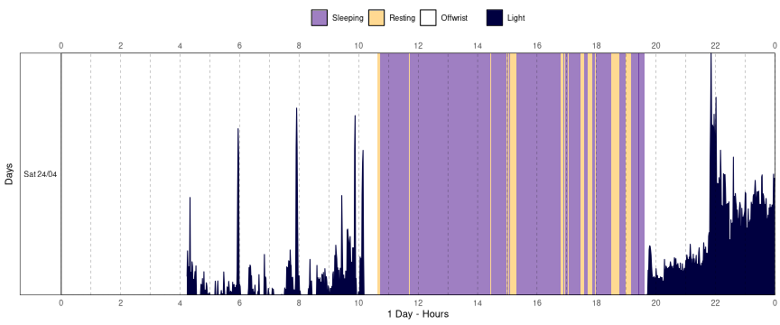

# Create an actogram plot from actigraphy data

`actogram()` creates an
[actogram](https://en.wikipedia.org/wiki/Actogram) plot from a
[`tsibble`](https://tsibble.tidyverts.org/reference/tsibble.html) time
series object, visualizing activity patterns across multiple days.

## Usage

``` r
actogram(
  data,
  col = "pim",
  days = 7,
  transform = identity,
  state_col = "state",
  state_alpha = 0.5,
  latitude = NULL,
  longitude = NULL,
  sun_stats_method = "suncalc",
  labels = NULL,
  colors = NULL,
  grid = TRUE,
  minor_breaks = ggplot2::waiver(),
  date_format = "%a %d/%m",
  locale = get_en_locale(),
  double_plot = TRUE,
  x_label = NULL,
  y_label = NULL,
  print = TRUE,
  ...
)
```

## Arguments

- data:

  A [`tsibble`](https://tsibble.tidyverts.org/reference/tsibble.html)
  object.

- col:

  (optional) A string indicating which column of `data` to use for the
  area plot (default: `"pim"`).

- days:

  (optional) A number specifying how many days to display in the
  actogram. Use a negative value to exclude days from the end of the
  record. Set to `Inf` to plot all available days (default: `7`).

- transform:

  (optional) A transformation function to apply to `col` (default:
  [`identity`](https://rdrr.io/r/base/identity.html)).

- state_col:

  (optional) A string indicating which column of `data` have the
  states/categories data (default: `NULL`).

- state_alpha:

  (optional) A number, from `0` to `1`, indicating the transparency
  level of the state rectangles (default: `0.5`).

- latitude:

  (optional) A number indicating the latitude in decimal degrees that
  must be used to compute the light/dark phase. Set this argument to
  `NULL` when the light/dark is not needed. See the Details section to
  learn more (default: `NULL`).

- longitude:

  (optional) A number indicating the longitude in decimal degrees that
  must be used to compute the light/dark phase. Set this argument to
  `NULL` when the light/dark is not needed. See the Details section to
  learn more (default: `NULL`).

- sun_stats_method:

  (optional) A string indicating the method to use for computing the
  light/dark phase. See
  [`get_sun_stats()`](https://danielvartan.github.io/actverse/reference/get_sun_stats.md)
  for more details (default: `"suncalc"`).

- labels:

  (optional) A named character vector to rename states in the legend.
  Must include labels for any used state values, and `"base"` (label for
  `col`), `"lp"` (light phase), and `"dp"` (dark phase) if applicable.
  See the Details section to learn more.

- colors:

  (optional) A named character vector of colors to use for each
  label/state. Must include named colors for any states used in
  `labels`, as well as for `"base"` (color for `col`), `"lp"` (light
  phase), and `"dp"` (dark phase). See the Details section to learn
  more.

- grid:

  (optional) A [`logical`](https://rdrr.io/r/base/logical.html) flag
  indicating if the plot must have an overlay grid (default: `TRUE`).

- minor_breaks:

  (optional) A [`numeric`](https://rdrr.io/r/base/numeric.html) vector
  indicating the minor breaks on the x-axis (default:
  [`waiver()`](https://ggplot2.tidyverse.org/reference/waiver.html)).

- date_format:

  (optional) Format string passed to
  [`format()`](https://rdrr.io/r/base/format.html) for rendering date
  axis labels (default: `"%a %d/%m"`).

- locale:

  (optional) A string indicating the locale the
  [`LC_TIME`](https://en.wikipedia.org/wiki/Locale_(computer_software))
  environment variable must be set to. This is used to determine the
  language of the date labels (default: `en_US.UTF-8`).

- double_plot:

  (optional) A [`logical`](https://rdrr.io/r/base/logical.html) flag
  indicating whether to stack 24-hour periods in a double-plot layout
  (default: `FALSE`).

- x_label:

  (optional) A string indicating the x-axis label (default: `NULL`).

- y_label:

  (optional) A string indicating the y-axis label (default: `NULL`).

- print:

  (optional) A [`logical`](https://rdrr.io/r/base/logical.html) flag
  indicating if the function must print the plot (default: `TRUE`).

- ...:

  (optional) Additional arguments passed to
  [`theme()`](https://ggplot2.tidyverse.org/reference/theme.html).

## Value

A [`ggplot`](https://ggplot2.tidyverse.org/reference/ggplot.html) object
with the actogram plot.

## Details

### Vertical lines in the plot

In some cases, you may notice thin vertical lines in the actogram
visualization. This is a rendering artifact that can depend on your
graphic device, graphics card, screen resolution, or the plot's size.

If you encounter this, try resizing the plot window (for example, making
it more square or adjusting its dimensions), which often resolves the
problem. We also strongly recommend using the
[`ragg`](https://ragg.r-lib.org/) package for rendering graphics, as it
can help avoid these artifacts.

### Light/Dark phase

The light/dark phase is determined using the first timestamp of the time
series. The time zone is inferred from this timestamp as well. If the
time zone does not correspond to the provided latitude and longitude,
the calculated light/dark phases may be misaligned.

### `transform` argument

`actogram()` allows you to provide a function for transforming the base
data. This is useful when dealing with extreme ranges.

Example:

    library(magrittr)

    trans_fun <- function(x) {
      log(x) |>
      inset(log(x) < 1, 1) |>
      subtract(1)
    }

    acttrust |>
      actogram(
        col = "light",
        days = 1,
        transform = trans_fun,
        double_plot = FALSE
      )



### `labels` argument

The `labels` arguments allow you to customize the labels of the states
in the actogram. It must be a named character vector, where the names
are the state values and the values are the labels to be used in the
legend. The order of the labels will be the same as the order of the
`labels` argument.

Example (default setting):

    labels <- c(
      "1" = "Sleeping",
      "2" = "Resting",
      "4" = "Offwrist",
      "base" = "PIM",
      "lp" = "Light phase",
      "dp" = "Dark phase"
    )

### `colors` argument

The `colors` arguments allow you to customize the colors of the states
in the actogram. Like the `label` argument, it must be a named character
vector, where the names are the state values and the values are the
colors to be used in the legend. The names of the `colors` must match
the names of the `labels`.

The colors follow the conventions used in
[`ggplot2`](https://ggplot2.tidyverse.org/reference/ggplot.html). You
can specify either standard color names or [hexadecimal color
codes](https://en.wikipedia.org/wiki/Web_colors). Click
[here](https://ggplot2.tidyverse.org/reference/aes_colour_fill_alpha.html)
to see the `ggplot2` color reference.

Example (default setting):

    colors = c(
      "1" = "#410085",
      "2" = "#FFB426",
      "4" = "#FC2913",
      "base" = "#000040",
      "lp" = "#FFFFFF",
      "dp" = "#DBD7D3"
    )

## Examples

``` r
library(curl)
#> Using libcurl 8.5.0 with OpenSSL/3.0.13

if (has_internet()) {
  file <- get_from_zenodo(
    doi = "10.5281/zenodo.4898822",
    dir = tempdir(),
    file = "processed.txt"
  )

  data <- read_acttrust(file, tz = "America/Sao_Paulo")

  data |>
    actogram(
      col = "pim",
      days = 7,
      # github.com/danielvartan/orbis
      # orbis::get_brazil_state_latitude("sp")
      latitude = -23.55065,
      # orbis::get_brazil_state_longitude("sp"),
      longitude = -46.63338,
      double_plot = TRUE
    )
}
#> ℹ Downloading metadata
#> ✔ Downloading metadata [730ms]
#> 
#> ℹ Downloading file
#> ✔ Downloading file [8ms]
#> 
#> ℹ Checking file integrity
#> ✔ Checking file integrity [17ms]
#> 
#> ℹ Reading data
#> ✔ Reading data [377ms]
#> 
#> ℹ Tidying data
#> ✔ Tidying data [504ms]
#> 
#> ℹ Validating data
#> ℹ Found 2 gap in the time series: 2021-04-26 03:14:00/2021-04-26 03:14:00 and 2021-05-01 17:34:00/2021-05-01 17:34:00 (showing up to a total of 5 values).
#> ℹ Validating data
#> ℹ Found 21 offwrist blocks in the time series. All values were set as NA.
#> ℹ Validating data
#> ✔ Validating data [17.2s]
#> 
```
