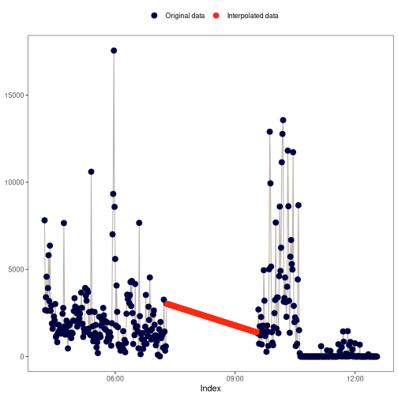
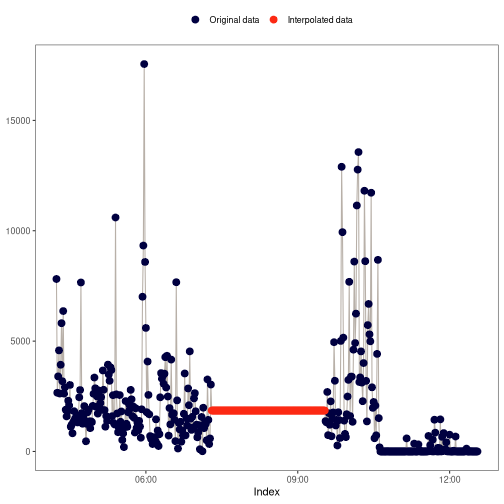

# Interpolate missing values in a numeric vector

The `actverse` package offers a suite of functions for handling missing
values through interpolation, all prefixed with `na_`. Refer to the
Methods section below for details on each available approach.

`na_plot()` provides a visual comparison of the original and
interpolated data, helping you assess and select the most appropriate
interpolation method for your dataset.

## Usage

``` r
na_approx(x, index, fill_na_tips = TRUE)

na_locf(x, fill_na_tips = TRUE)

na_overall_mean(x)

na_overall_median(x)

na_overall_mode(x)

na_spline(x, index)

na_weekly_mean(x, index, fill_na_tips = TRUE, week_start = 1)

na_zero(x)

na_plot(x, index, intp = NULL, print = TRUE)
```

## Arguments

- x:

  A [`numeric`](https://rdrr.io/r/base/numeric.html) vector.

- index:

  An [`atomic`](https://rdrr.io/r/base/is.recursive.html) vector with
  the same length as `x` representing the index of a time series.

- fill_na_tips:

  (optional) A [`logical`](https://rdrr.io/r/base/logical.html) flag
  indicating if the function must fill remaining `NA` values with the
  closest non-missing data point. Learn more about it in the Details
  section (default: `TRUE`).

- week_start:

  (optional) An integer indicating the day on which the week starts (`1`
  for Monday and `7` for Sunday) (default: `1`).

- intp:

  (optional) A [`numeric`](https://rdrr.io/r/base/numeric.html) vector
  of the same length as `x`, containing the interpolated values to be
  compared with the original data (default: `NULL`).

- print:

  (optional) A [`logical`](https://rdrr.io/r/base/logical.html) flag
  indicating if the function must print the plot (default: `TRUE`).

## Value

- For `na_*`: A [`numeric`](https://rdrr.io/r/base/numeric.html) vector
  with the same length as `x`.

- For `na_plot()`: A
  [`ggplot`](https://ggplot2.tidyverse.org/reference/ggplot.html) object
  with a point and line chart showing the original data versus the
  interpolated data.

## Details

### Interpolation in actigraphy

Few articles address interpolation methods specifically for actigraphy
data. Tonon et al. (2022) recommend avoiding interpolation—i.e.,
retaining `NA` values—whenever possible. When interpolation is necessary
(for example, when certain analyses cannot be performed with missing
values), the authors suggest using the *weekly mean method* as the
preferred approach.

### `fill_na_tips` argument

Some interpolation methods can result in outputs with remaining `NA`
values. That is the case, for example, with the linear interpolation
method (`na_approx()`).

Example:

    x <- c(NA, 1, 5, 10, NA, 5, 10, 1, NA, 10, 1, 5, NA, NA)
    index <- seq(as.Date("2020-01-01"), as.Date("2020-01-14"), by = "day")

    na_approx(x, index, fill_na_tips = FALSE)
    #>  [1]   NA  1.0  5.0 10.0  7.5  5.0 10.0  1.0  5.5 10.0  1.0  5.0   NA   NA

  
By using `fill_na_tips == TRUE` (default), the function will fill those
gaps with the closest non-missing data point.  

Example:

    na_approx(x, index, fill_na_tips = TRUE)
    #>  [1]  1.0  1.0  5.0 10.0  7.5  5.0 10.0  1.0  5.5 10.0  1.0  5.0  5.0  5.0

## Methods

### `na_approx()`: Linear interpolation

This method fills gaps in `x` by linearly interpolating between
non-missing values, creating a straight-line "bridge" across missing
data points. For more details, see
[`zoo::na.approx()`](https://rdrr.io/pkg/zoo/man/na.approx.html) and
[`stats::approx()`](https://rdrr.io/r/stats/approxfun.html).

Visual example:  


### `na_locf()`: Last observation carried forward

  
This method replaces `NA` values with the preceding observation of the
`NA` block.

Visual example:  


### `na_overall_mean()`: Overall mean

This method replaces `NA` values with the overall mean of `x`.

Visual example:  


### `na_overall_median()`: Overall median

This method replaces `NA` values with the overall median of `x`.

Visual example:  


### `na_overall_mode()`: Overall mode

This method replaces `NA` values with the most frequent value (mode) of
`x`.

If no mode can be found, the function will return `x` without any
interpolation. `na_overall_mode()` will show a warning message to inform
the user if that happens.

Visual example:  


### `na_spline()`: Cubic spline interpolation

This method uses low-degree polynomials in each of the intervals, and
chooses the polynomial pieces such that they fit smoothly together. It
can produce extreme values when dealing with large gaps.

See [`stats::spline()`](https://rdrr.io/r/stats/splinefun.html) and
[`zoo::na.spline()`](https://rdrr.io/pkg/zoo/man/na.approx.html) to
learn more on the [spline
method](https://en.wikipedia.org/wiki/Spline_interpolation).

Visual example:  


### `na_weekly_mean()`: Weekly mean

This method replaces `NA` values with the weekly mean of `x`. For
datasets with only one week in the `index`, the result will be the same
as `na_overall_mean()`.

Visual example:  


### `na_zero()`: Replace `NA` with `0`s

This method replaces `NA` values with `0`s.

Visual example:  


## References

Tonon, A. C. et al. (2022). Handling missing data in rest-activity time
series measured by actimetry. *Chronobiology International*, *39*(7).
[doi:10.1080/07420528.2022.2051714](https://doi.org/10.1080/07420528.2022.2051714)
.

## Examples

``` r
x <- c(NA, 1, 5, 10, NA, 5, 10, 1, NA, 10, 1, 5, NA, NA)
index <- seq(as.Date("2020-01-01"), as.Date("2020-01-14"), by = "day")

x
#>  [1] NA  1  5 10 NA  5 10  1 NA 10  1  5 NA NA
#> [1] NA  1  5 10 NA  5 10  1 NA 10  1  5 NA NA # Expected

na_plot(x, index)


## 'na_approx()': Linear interpolation

na_approx(x, index, fill_na_tips = FALSE)
#>  [1]   NA  1.0  5.0 10.0  7.5  5.0 10.0  1.0  5.5 10.0  1.0  5.0   NA   NA
#> [1]   NA  1.0  5.0 10.0  7.5  5.0 10.0  1.0  5.5 10.0 # Expected
#> [11] 1.0  5.0  NA   NA

na_plot(x, index, na_approx(x, index, fill_na_tips = FALSE))


na_approx(x, index, fill_na_tips = TRUE)
#>  [1]  1.0  1.0  5.0 10.0  7.5  5.0 10.0  1.0  5.5 10.0  1.0  5.0  5.0  5.0
#> [1]   1.0  1.0  5.0 10.0  7.5  5.0 10.0  1.0  5.5 10.0 # Expected
#> [11] 1.0  5.0  5.0  5.0

na_plot(x, index, na_approx(x, index, fill_na_tips = TRUE))


## 'na_locf()': Last observation carried forward

na_locf(x, fill_na_tips = FALSE)
#>  [1] NA  1  5 10 10  5 10  1  1 10  1  5  5  5
#> [1] NA  1  5 10 10  5 10  1  1 10  1  5  5  5 # Expected

na_plot(x, index, na_locf(x, fill_na_tips = FALSE))


na_locf(x, fill_na_tips = TRUE)
#>  [1]  1  1  5 10 10  5 10  1  1 10  1  5  5  5
#> [1]  1  1  5 10 10  5 10  1  1 10  1  5  5  5 # Expected

na_plot(x, index, na_locf(x, fill_na_tips = TRUE))


## 'na_overall_mean()': Overall mean

na_overall_mean(x)
#>  [1]  5.333333  1.000000  5.000000 10.000000  5.333333  5.000000 10.000000
#>  [8]  1.000000  5.333333 10.000000  1.000000  5.000000  5.333333  5.333333
#> [1]  5.333333  1.000000  5.000000 10.000000  5.333333  5.000000 10.000000
#> [8] 1.000000 5.333333 10.000000  1.000000  5.000000  5.333333
#> [14] 5.333333 # Expected

mean(x, na.rm = TRUE)
#> [1] 5.333333
#> [1] 5.333333 # Expected

na_plot(x, index, na_overall_mean(x))


## 'na_overall_median()': Overall median

na_overall_median(x)
#>  [1]  5  1  5 10  5  5 10  1  5 10  1  5  5  5
#> [1]  5  1  5 10  5  5 10  1  5 10  1  5  5  5 # Expected

stats::median(x, na.rm = TRUE)
#> [1] 5
#> [1] 5 # Expected

na_plot(x, index, na_overall_median(x))


## 'na_overall_mode()': Overall mode

na_overall_mode(x)
#> ! No mode was found. x was not interpolated.
#>  [1] NA  1  5 10 NA  5 10  1 NA 10  1  5 NA NA
#> ! No mode was found. x was not interpolated.
#> [1] NA  1  5 10 NA  5 10  1 NA 10  1  5 NA NA # Expected

x2 <- append(x, 1)
index2 <- append(index, as.Date("2020-01-15"))

na_overall_mode(x2)
#>  [1]  1  1  5 10  1  5 10  1  1 10  1  5  1  1  1
#> [1]  1  1  5 10  1  5 10  1  1 10  1  5  1  1  1 # Expected

na_plot(x2, index2, na_overall_mode(x2))


## 'na_spline()': Cubic spline interpolation

na_spline(x, index)
#>  [1]   4.567728   1.000000   5.000000  10.000000   6.589146   5.000000
#>  [7]  10.000000   1.000000   5.037198  10.000000   1.000000   5.000000
#> [13]  42.905390 131.216171
#> [1]  4.567728   1.000000   5.000000  10.000000   6.589146   5.000000
#> [7]  10.000000  1.000000   5.037198  10.000000   1.000000   5.000000
#> [13] 42.905390 131.216171 # Expected

na_plot(x, index, na_spline(x, index))


## 'na_weekly_mean()': Weekly mean

na_weekly_mean(x, index, fill_na_tips = FALSE)
#>  [1]  5.333333  1.000000  5.000000 10.000000  5.333333  5.000000 10.000000
#>  [8]  1.000000  5.333333 10.000000  1.000000  5.000000        NA        NA
#> [1]  5.333333  1.000000  5.000000 10.000000  5.333333  5.000000 10.000000
#> [8] 1.000000 5.333333 10.000000  1.000000  5.000000  NA  NA # Expected

na_plot(x, index, na_weekly_mean(x, index, fill_na_tips = FALSE))


na_weekly_mean(x, index, fill_na_tips = TRUE)
#>  [1]  5.333333  1.000000  5.000000 10.000000  5.333333  5.000000 10.000000
#>  [8]  1.000000  5.333333 10.000000  1.000000  5.000000  5.000000  5.000000
#> [1]  5.333333  1.000000  5.000000 10.000000  5.333333  5.000000 10.000000
#> [8] 1.000000 5.333333 10.000000  1.000000  5.000000  5.000000
#> [14] 5.000000 # Expected

na_plot(x, index, na_weekly_mean(x, index, fill_na_tips = TRUE))


## 'na_zero()': Replace 'NA' with '0's

na_zero(x)
#>  [1]  0  1  5 10  0  5 10  1  0 10  1  5  0  0
#> [1]  0  1  5 10  0  5 10  1  0 10  1  5  0  0 # Expected

na_plot(x, index, na_zero(x))
```
